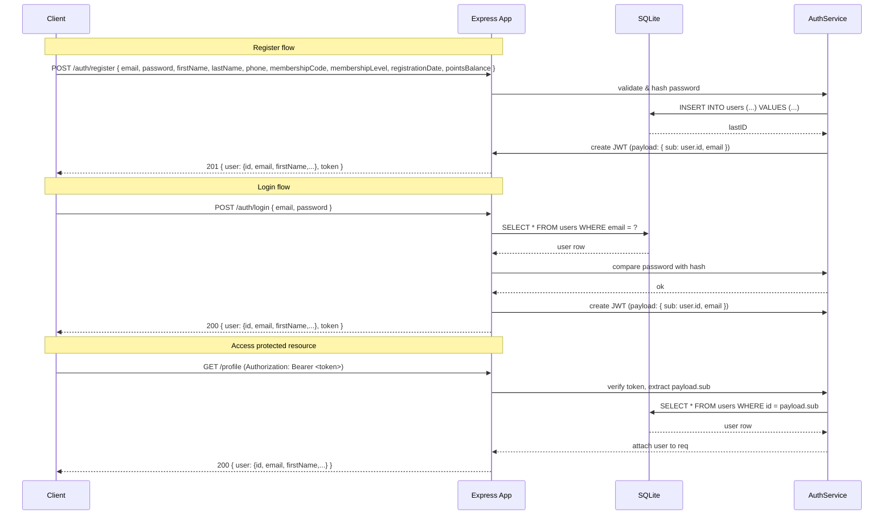

# Authentication design — sequence and ER diagrams

This document describes the authentication flow (register, login, profile access) and the user data model used by the `express-ts-api` project. Diagrams are written in Mermaid so they can be rendered by tools that support it (VS Code, GitHub, etc.).

## Sequence diagram — Register, Login and Profile



## ER Diagram — Users table

```mermaid
erDiagram
    USERS {
        INTEGER id PK
        TEXT email UNIQUE
        TEXT passwordHash
        TEXT firstName
        TEXT lastName
        TEXT phone
        TEXT membershipCode
        TEXT membershipLevel
        TEXT registrationDate
        INTEGER pointsBalance
    }

    %% No other tables currently; this diagram lists attributes and keys for clarity.
```

## Data shapes (TypeScript interfaces)

- User (returned in API responses, passwordHash omitted):

```ts
interface User {
  id?: number;
  email: string;
  firstName?: string;
  lastName?: string;
  phone?: string;
  membershipCode?: string;
  membershipLevel?: string;
  registrationDate?: string; // ISO date
  pointsBalance?: number;
}
```

- Register request:

```json
{
  "email": "somchai@example.com",
  "password": "pass123",
  "firstName": "Somchai",
  "lastName": "Jaid",
  "phone": "081-234-5678",
  "membershipCode": "LBK001234",
  "membershipLevel": "Gold",
  "registrationDate": "2023-06-15",
  "pointsBalance": 15420
}
```

## Notes and operational details
- Tokens: signed using HMAC (HS256) with `JWT_SECRET` from environment. Tokens include `sub` (user id) and `email` and expire after 1 hour.
- DB migration: code includes a helper `ensureUserColumns` that will ALTER TABLE to add missing columns when the app starts. For production, replace with a proper migration tool (Knex, Prisma, Flyway, etc.).
- Security: store `JWT_SECRET` securely, and never commit secrets. `.env` is used for local development (don't commit `.env` for production).

If you'd like, I can add diagrams for additional flows (token refresh, password reset) or generate SQL migration scripts to apply the schema changes explicitly.
